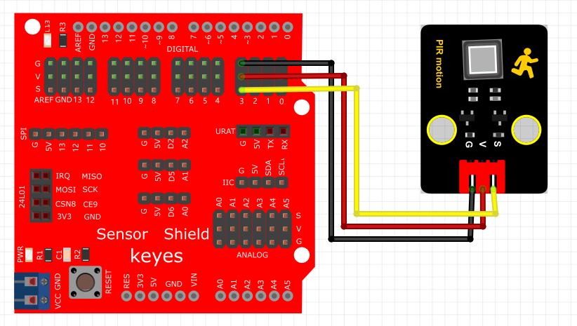
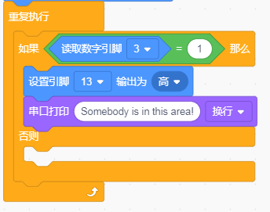
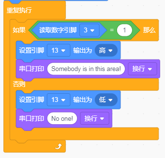
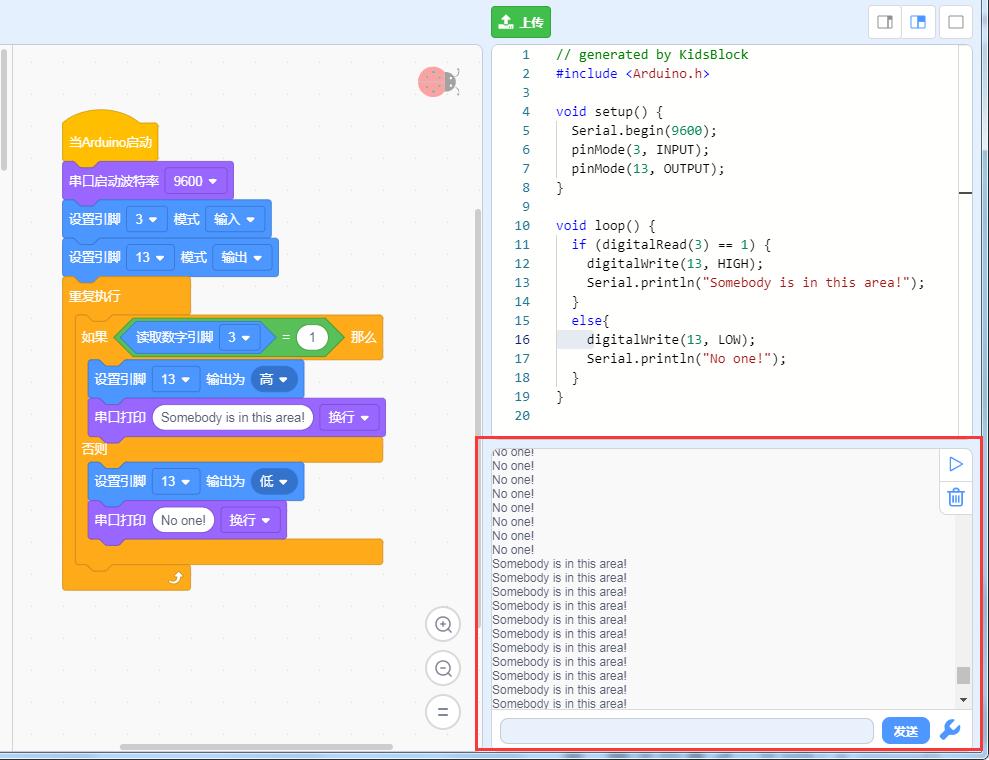

# KidsBlock

## 1. KidsBlock简介  

KidsBlock是一款针对初学者的图形化编程平台，旨在通过简化的可视化界面，使得编程变得更加直观和有趣。该工具通过拖放编程模块，让用户可以轻松创建自己的应用和项目，无需深厚的编程背景，从而有效避免语法错误。KidsBlock不仅适合儿童和青少年学习编程，还能够帮助教育工作者进行有效的教学。它支持多种硬件平台，包括Arduino，用户可以使用多种传感器和组件进行互动创作，同时通过视觉化编程的方式培养逻辑思维和解决问题的能力。  

## 2. 连接图  

  

## 3. 测试代码  

1. 在事件栏拖出Arduino启动模块。  

     

2. 在引脚栏拖出两个设置引脚模式模块，一个设置为引脚3输入，另一个设置为引脚13输出。  

     

3. 在控制栏拖出重复执行模块。  

     

4. 在控制栏拖出判断模块，然后在判断模块里添加运算的等于模块，等于模块的左边添加读取数字引脚3模块，右边为0；满足条件时放第13引脚输出高电平，并在串口栏拖出串口打印模块设置文字为"Somebody is in this area!"。  

     

5. 当不满足条件时第13引脚输出低电平，并在串口栏拖出串口打印模块设置文字为"No one!"。  

     

## 4. 测试结果  

烧录好测试代码，按照接线图连接好线，利用USB线上电后，打开串口监视器，设置波特率为9600。在检测到人体运动时，Plus板上D13的指示灯亮起，串口监视器中显示"Somebody is in this area!"；而没有检测到人体运动时，Plus板上D13的指示灯熄灭，串口监视器中显示"No one!"。   

