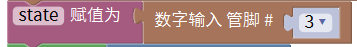
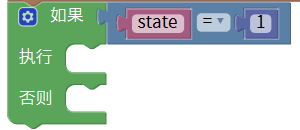
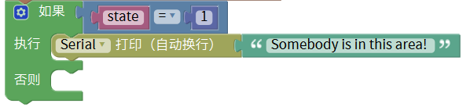
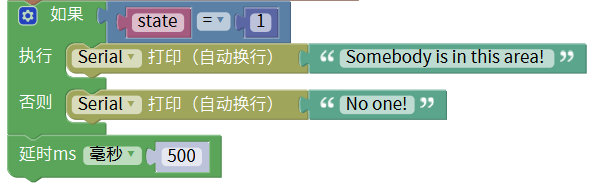
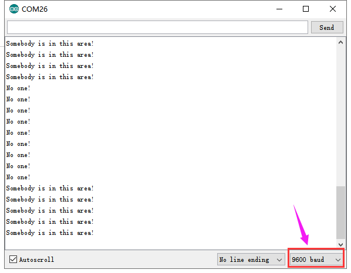

# Mixly

## 1. Mixly简介  

Mixly是一款面向初学者的图形化编程工具，旨在通过简单易用的可视化界面，降低编程的入门门槛。用户可以通过拖拽各种编程模块进行编程，而无需书写复杂的代码，从而减少了与编程相关的语法错误。Mixly支持与多种硬件平台（如Arduino）兼容，不仅适用于儿童和青少年学习编程，也适合教育工作者进行有效的教学。其直观的设计使得用户可以更专注于逻辑和功能的实现，从而提升他们的创造力和解决问题的能力。  

## 2. 连接图  

  

## 3. 测试代码  

1. 在变量栏拖出声明变量模块，设置变量名为state并赋值为0。  

     

2. 在变量栏拖出state赋值模块，并在输入/输出栏拖出数字管脚模块设置管脚为3，然后赋值给state模块。  

     

3. 在输入/输出栏拖出数字引脚设置模块，管脚为13，状态为变量state（这一句是把人体传感器接收到的值赋值给LED灯，从而达到控制的效果）。  

     

4. 在控制栏拖出判断模块并在逻辑栏拖出等于模块，然后再变量栏拖出state变量模块放在等于模块的第一个格子里，在数学栏拖出数字模块放在等于模块的第二格并设置为1。  

     

5. 在串口栏拖出串口打印并（自动换行）模块，然后再在文本栏拖出文本模块并编辑文本为“Somebody is in this area!”。  

     

6. 在串口栏拖出串口打印并（自动换行）模块，然后再在文本栏拖出文本模块并编辑文本为“No one!” ；最后再加一个延时500ms。  

     

## 4. 测试结果  

烧录好测试代码，按照接线图连接好线，利用USB线上电后，打开串口监视器，设置波特率为9600。当检测到人体运动时，Plus板上D13的指示灯亮起，串口监视器中显示"Somebody is in this area!"；而没有检测到人体运动时，Plus板上D13的指示灯熄灭，串口监视器中显示"No one!"。  

