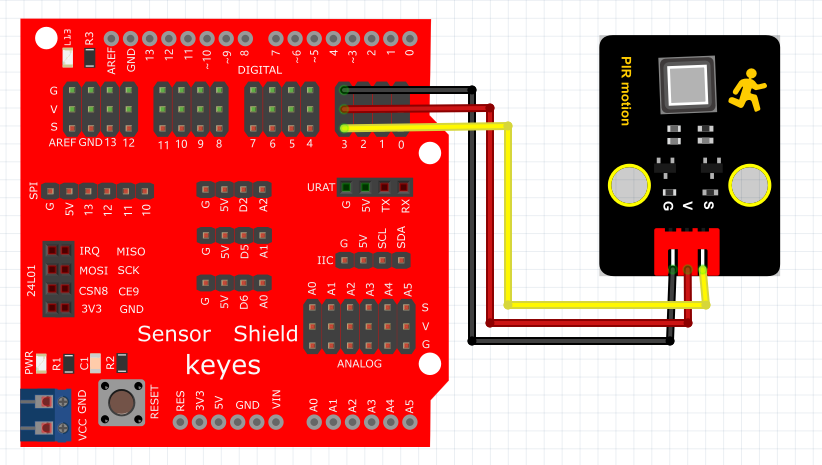

# Python


## 1. Python简介  

Python是一种高效、通用的高级编程语言，因其简洁明了的语法和强大的功能而受到广泛欢迎。自1991年发布以来，Python已经成为程序员、数据科学家和开发者的首选工具之一。它支持多种编程范式，包括面向对象和函数式编程，拥有丰富的标准库和众多的第三方库（如NumPy、Pandas、Flask等），极大地提升了开发效率和项目实现的灵活性。Python的易读性和可维护性使其非常适合于教育和快速原型开发，适用于数据分析、人工智能、Web开发、自动化等多个领域。  

## 2. 连接图  

  

## 3. 测试代码  

```python  
import machine  
import utime  

led = machine.Pin(25, machine.Pin.OUT)  # 设置25脚为LED输出  
sensorPin = machine.Pin(28, machine.Pin.IN)  # 设置28脚为传感器输入  

while True:  
    if sensorPin.value() == 1:  # 判断传感器输入的值是否为1  
        led.value(1)  # LED灯亮  
    else:  
        led.value(0)  # LED灯灭  
```  

## 4. 测试结果  

烧录好测试代码后，按照接线图连接好线，并通过USB供电。检测到人体运动时，Pico板上的LED灯亮起；而没有检测到人体运动时，Pico板上的LED灯熄灭。


